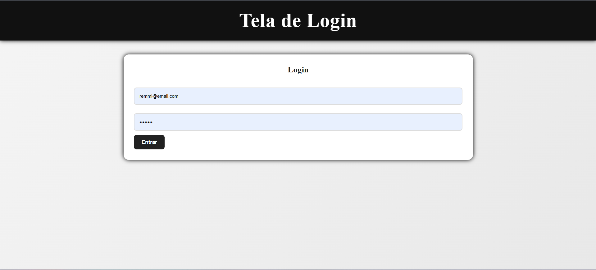
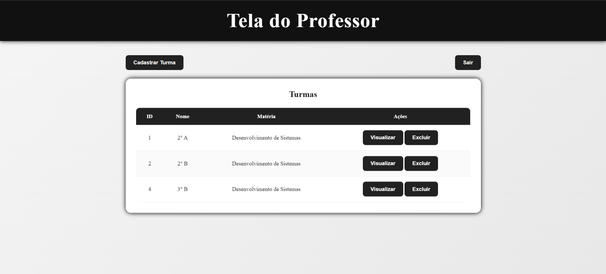
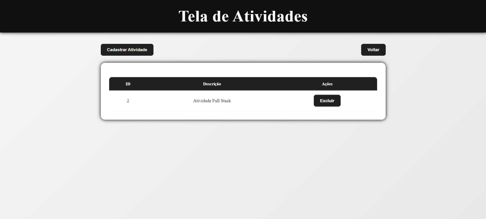
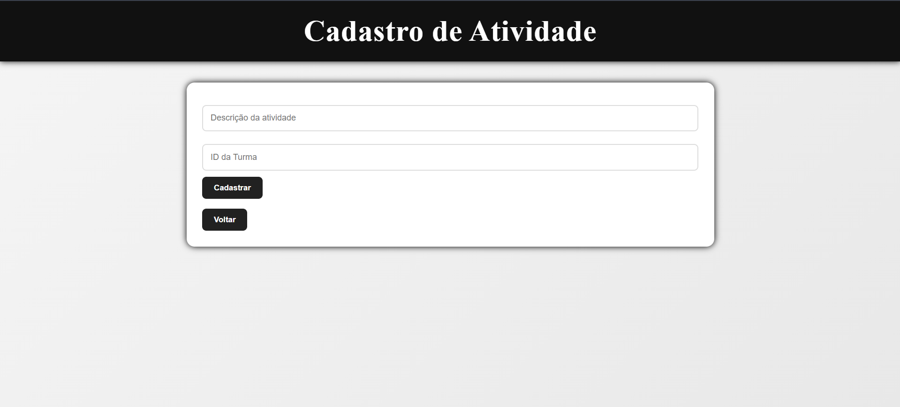
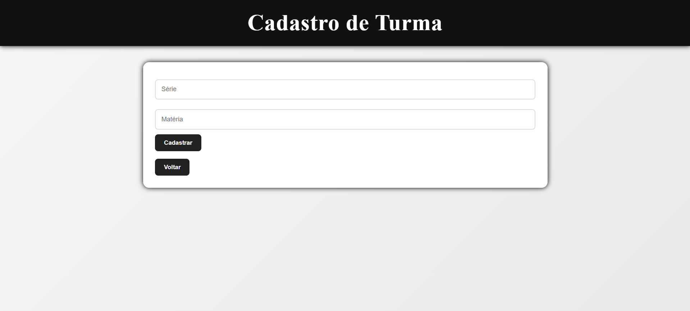
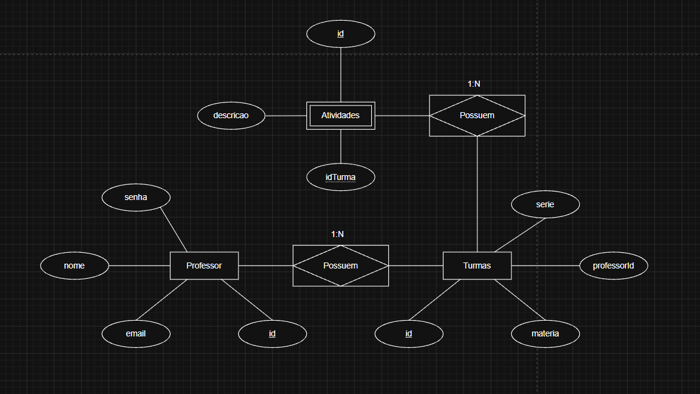

# Atividade Full Stack

## Editor IDE 
* VsCode 

## SGBD 
* XAMPP(v.3.3.0) - MySQL

## Print das telas principais
|Tela Login|Tela Professores|Tela Atividades|Cadastro Atividades|Cadastro Turmas|
|:-:|:-:|:-:|:-:|:-:|
||||||

## Servidor de aplicação 
* Node.JS(v.22.12.1)

## Linguagens e versão são utilizadas no sistema desenvolvido
* HTML5
* CSS
* JavaScript

## Tutorial de como testar o aplicativo
* clone o repositório
* Abra a pasta api e execute no cmd 
```
npm i
npx prisma generate
npm run dev
```

Após startar a API abra o ./web/index.html e teste o site

## DER
